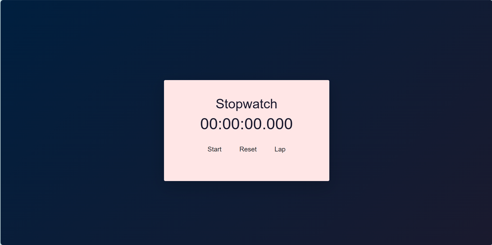

# Stopwatch Web Application

This is a simple and interactive stopwatch web application built using HTML, CSS, and JavaScript.

## Features

- Start, stop, and reset the stopwatch.
- Record lap times.
- Aesthetic design with a gradient background, rounded container, and pastel-colored buttons.

## Technologies Used

- HTML
- CSS
- JavaScript
- Bootstrap (for basic styling)

## Setup

1. Clone the repository or download the ZIP file.
2. Open the `index.html` file in your web browser to use the stopwatch.

## Usage

- **Start/Stop Button**: Starts or stops the stopwatch.
- **Reset Button**: Resets the stopwatch to `00:00:00.000` and clears all lap times.
- **Lap Button**: Records the current time as a lap and displays it below the stopwatch.

## Customization

- You can modify the colors and styling by editing the `styles.css` file.
- The functionality can be extended or modified by editing the `script.js` file.

## Screenshots

